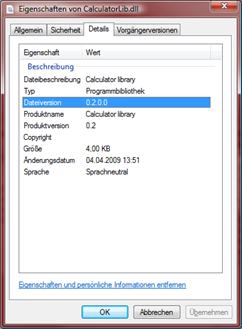

# Modifying AssemblyInfo and File Version via FAKE

In this article the AssemblyInfo task is used in order to set a specific version info to .NET assemblies.

If you succeeded with the [Getting Started tutorial](gettingstarted.html), then you just have to modify your *BuildApp* target to the following:

    open Fake.AssemblyInfoFile

	Target "BuildApp" (fun _ ->
		CreateCSharpAssemblyInfo "./src/app/Calculator/Properties/AssemblyInfo.cs"
			[Attribute.Title "Calculator Command line tool"
			 Attribute.Description "Sample project for FAKE - F# MAKE"
			 Attribute.Guid "A539B42C-CB9F-4a23-8E57-AF4E7CEE5BAA"
			 Attribute.Product "Calculator"
			 Attribute.Version version
			 Attribute.FileVersion version]

		CreateCSharpAssemblyInfo "./src/app/CalculatorLib/Properties/AssemblyInfo.cs"
			[Attribute.Title "Calculator library"
			 Attribute.Description "Sample project for FAKE - F# MAKE"
			 Attribute.Guid "EE5621DB-B86B-44eb-987F-9C94BCC98441"
			 Attribute.Product "Calculator"
			 Attribute.Version version
			 Attribute.FileVersion version]

		MSBuildRelease buildDir "Build" appReferences
		  |> Log "AppBuild-Output: "
	)

As you can see modifying an AssemblyInfo.cs file is pretty easy with FAKE. The AssemblyInfo task works for C# and F#. 

## Setting the version no.

The version parameter can be declared as a property or fetched from a build server like TeamCity:

	let version =
	  match buildServer with
	  | TeamCity -> buildVersion
	  | _ -> "0.2"

