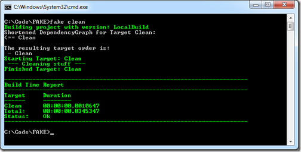

# Running FAKE targets from the command line

For this short sample we assume you have the latest version of FAKE in *./FAKE/tools/*. Now consider the following small FAKE script:

	#r "FAKE/tools/FakeLib.dll"
	open Fake 
 
	Target "Clean" (fun () ->  trace " --- Cleaning stuff --- ")
 
	Target "Build" (fun () ->  trace " --- Building the app --- ")
 
	Target "Deploy" (fun () -> trace " --- Deploying app --- ")
 
 
	"Clean"
	  ==> "Build"
	  ==> "Deploy"
 
	RunTargetOrDefault "Deploy"

If you are on windows then create this small redirect script:

	[lang=batchfile]
	@echo off
	"FAKE\tools\Fake.exe" "%1"
	exit /b %errorlevel%

On mono you can use:

	[lang=batchfile]
	#!/bin/bash
    mono ./FAKE/tools/FAKE.exe "$@"

Now you can run FAKE targets easily from the command line:

