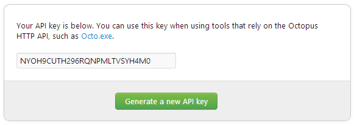

# Automating Deployment using FAKE and Octopus Deploy

[Octopus Deploy](http://octopusdeploy.com/) is a great tool for simple and user-friendly release management.

## Installing Octopus Deploy

You can download the [free community edition](http://octopusdeploy.com/purchase) of Octopus Deploy from [http://octopusdeploy.com/downloads](http://octopusdeploy.com/downloads) - and then follow the [Installation Instructions](http://octopusdeploy.com/documentation/install/octopus) to get yourself up and running.

You will also need to install and configure at least one [Tentacle](http://octopusdeploy.com/documentation/install/tentacle) which you will deploy your software and services to.

## Octopus Deploy HTTP API and Octopus Tools

Octopus Deploy has a REST-style [HTTP API](http://octopusdeploy.com/documentation/api) available at `http://your-octopus-server/api` which we will be using via the [Octopus Tools](https://github.com/OctopusDeploy/Octopus-Tools), controlled from a FAKE script.

You should add the [OctopusTools NuGet](http://www.nuget.org/packages/OctopusTools/) package to your solution, which you can also [resolve from a FAKE script](nuget.html) - which you will need in order to use the [OctoTools](apidocs/fake-octotools.html) from a FAKE script.

### Generate an API Key

In order to communicate with the Octopus Deploy API you will need an *API key* to authenticate with.

It is a good idea to create an account in Octopus Deploy for your Continuous Integration systems (eg: [TeamCity](docs/teamcity.html)) - and then generate a new API key for that account, that can be safely used from within your build process.

## Create a Release

Octopus Deploy relies on the concept of a **release**, which should be an immutable *NuGet Package* which has been built, tested, [packaged and published](apidocs/fake-nugethelper.html) from your Continuous Integration systems - which you can of course completely manage with your FAKE script.

So once you have created a project you are able to create a push a release into Octopus Deploy. This can be done through the Octopus UI, command line tool, or in our case - from a FAKE script.

    open OctoTools

	Target "Release" (fun _ ->
		let release = { releaseOptions with Project = "Order Processor" }
		let server = { Server = "http://your-octopus-server/api"; ApiKey   = "YOUR-CI-API-KEY-HERE" }

		Octo (fun octoParams ->
			{ octoParams with
				ToolPath = "./packages/octopustools"
				Server   = server
				Command  = CreateRelease (release, None) }
		)
	)

In this instance both the `releaseOptions` and `octoParams` contain assumed default values that will fail by default. `CreateRelease` allows you to also deploy the release at the same time, but since we're not interested in doing this at this moment - we'll set our `deployOptions` to `None`.

## Deploy a Release

You can automatically deploy a release when you create it, but using the optional deploy options when you create your release.

This is often a good idea when you want your FAKE build script to continue on to a second set of perhaps slower, unit tests that exercise behaviours in a more complete and perhaps integrated environment. 

    open OctoTools

	Target "ReleaseAndDeploy" (fun _ ->
		let release = { releaseOptions with Project = "Order Processor" }
		let deploy  = { deployOptions with DeployTo = "TestEnvironment" }
		let server = { Server = "http://your-octopus-server/api"; ApiKey   = "YOUR-CI-API-KEY-HERE" }

		Octo (fun octoParams ->
			{ octoParams with
				ToolPath = "./packages/octopustools"
				Server   = server
				Command  = CreateRelease (release, Some deploy) }
		)
	)

In this instance we've used the default `deployOptions` and modified the environment that we're going to deploy to - this is then passed into the `CreateRelease`.

## Promote a Release

Finally when you are absolutely happy that your release is good to go the next stage (be that some manual or exploratory testing, or perhaps a staging environment). We can use a `DeployRelease` command to promote an existing release to the next environment:

	open OctoTools

	Target "PromoteRelease" (fun _ ->
		let promote = { deployOptions with 
                          Project = "Order Processor"
                          DeployTo = "UatEnvironment" }
		let server = { Server = "http://your-octopus-server/api"; ApiKey   = "YOUR-CI-API-KEY-HERE" }

		Octo (fun octoParams ->
			{ octoParams with
				ToolPath = "./packages/octopustools"
				Server   = server
				Command  = DeployRelease (promote) }
		)
	)
