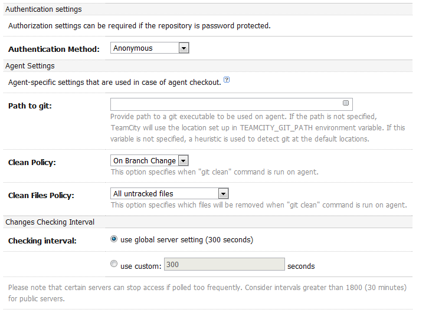
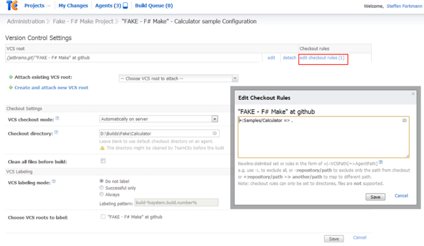
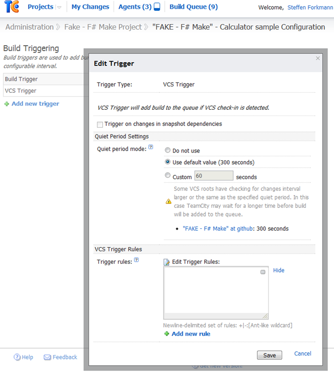
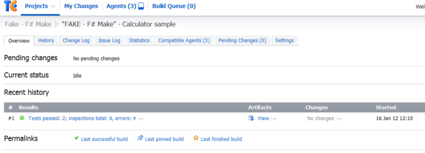

# Integrating a FAKE build script into TeamCity

Easy [TeamCity](http://www.jetbrains.com/teamcity/) integration was one of the major goals for the FAKE build system.

In this article you will learn how to set up a FAKE build script in TeamCity. We will use the CalculatorSample which you can build from the [getting started guid](gettingstarted.html).

## Installing TeamCity

You can download the free professional edition of TeamCity from [http://www.jetbrains.com/teamcity/](http://www.jetbrains.com/teamcity/). After the installation process you should be ready to configure your first build.

## Creating a FAKE project on TeamCity

Now create a new project and add a build configuration:

You also need to set the artifacts paths:

## Attach a VCS root

The next step is to attach a VCS root. For this sample we will use the official FAKE repository at [https://github.com/forki/FAKE/](https://github.com/forki/FAKE/).

If you want you could also add a build trigger to your build script:

## Running the build

Now if everything is configured correctly, you can run your build and the output should look like:

You can also inspect the NUnit results:

